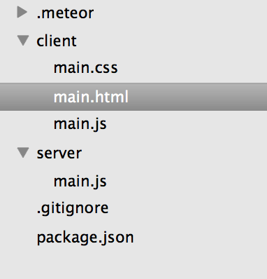

#Meteor Note

* 新增專案 `meteor create app_name`，app_name 為專案名稱
* 進去專案後，執行 `meteor`

## 看 code
* 看到有兩個資料夾，一個 **server**、**client** 兩個資料夾，不用猜就知道分別是 for 後端、前端

* 

---
* 文件：[http://docs.meteor.com/](http://docs.meteor.com/)